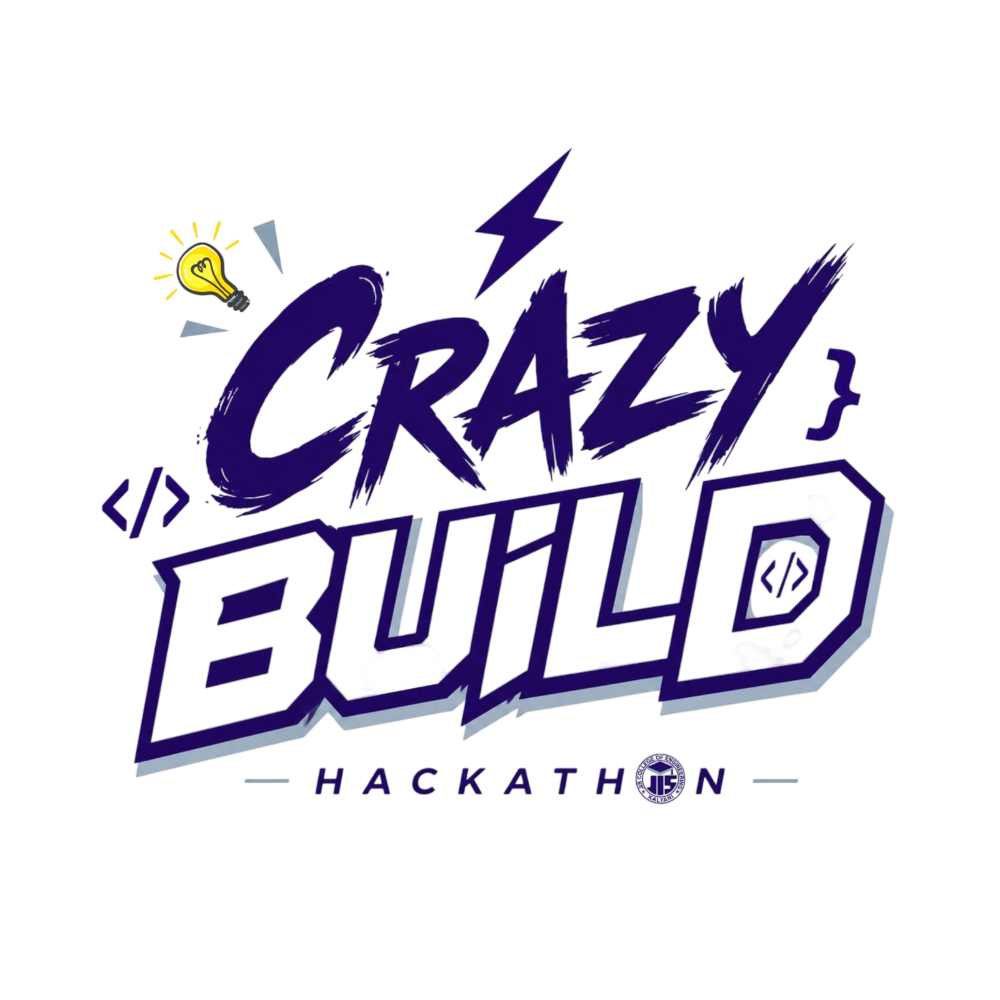

# Crazy Build 2026



A designer's sketchbook mixed with an engineer's notebook. **Crazy Build** is the premier hackathon hosted at JISCE Campus in Kalyani, Nadia, bringing together the best minds in design and engineering for an unforgettable 48 hours of chaos, creativity, and code.

## 🚀 Overview

- **Date:** January 2026
- **Location:** JISCE Campus, Kalyani, Nadia
- **Format:** In-person 48-hour Hackathon
- **Theme:** Open Innovation / Best use of specific tracks
- **Website:** (Deployment URL)

## ✨ Tech Stack

This landing page was built with a modern stack for a fast, responsive, and visually striking experience:

- **Framework:** [Next.js 14](https://nextjs.org/) (App Router)
- **Language:** TypeScript
- **Styling:** [Tailwind CSS](https://tailwindcss.com/)
- **Animations:** [Framer Motion](https://www.framer.com/motion/)
- **Design Aesthetic:** Brutalist / Sketchbook / Paper-grain UI

## 💻 Running Locally

1. **Clone the repository**
   ```bash
   git clone https://github.com/Abhi6537/crazy_build.git
   cd crazy_build
   ```

2. **Install dependencies**
   ```bash
   npm install
   ```

3. **Run the development server**
   ```bash
   npm run dev
   ```

4. **Open your browser**
   Navigate to [http://localhost:3000](http://localhost:3000)

## 🎨 Design System

The website uses a unique "notebook" aesthetic, featuring:
- A custom `paper-grain` background texture.
- Brutalist solid shadows (`#1a1a1a`).
- Handwritten accents using the `Caveat` font.
- Primary colors: **Deep Black**, **Paper White**, **Vibrant Orange** (`#FF4D00`), **Electric Blue** (`#0055FF`), and **Red** (`#FF0033`).

## 🤝 The Team

Organized by the **Coding Club, JISCE** and powered by **Rabbitt AI**.

## 📝 License

2026 Crazy Build. All rights reserved.
